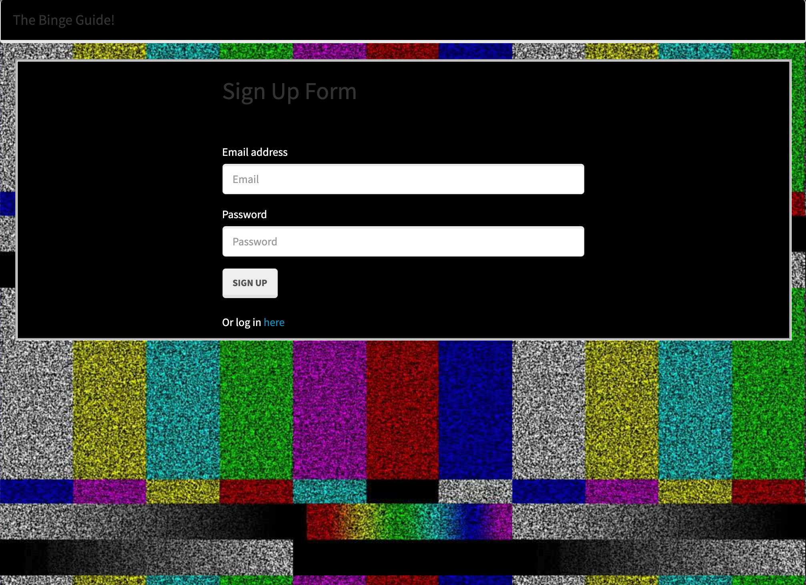
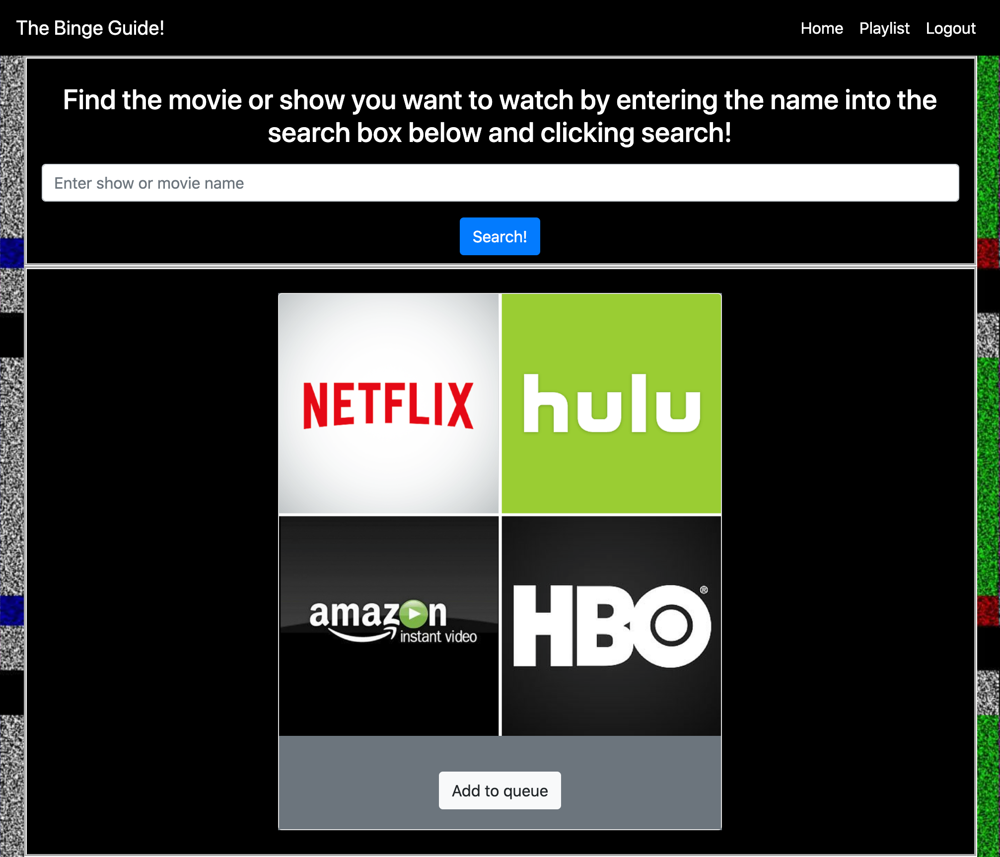
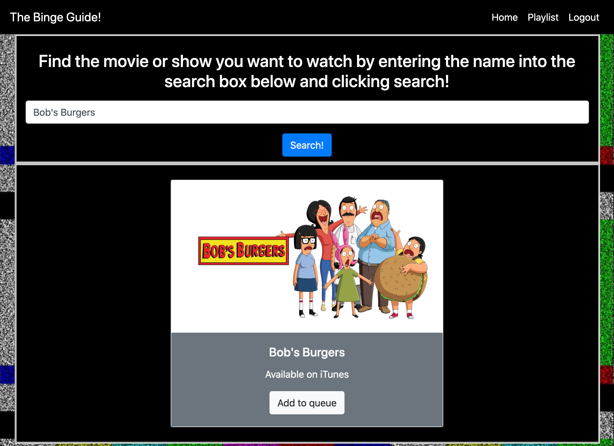
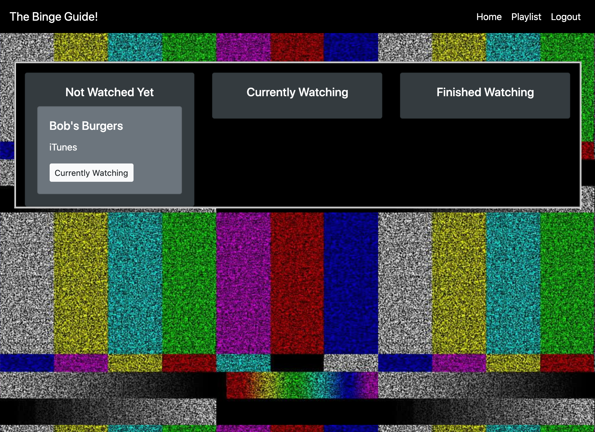
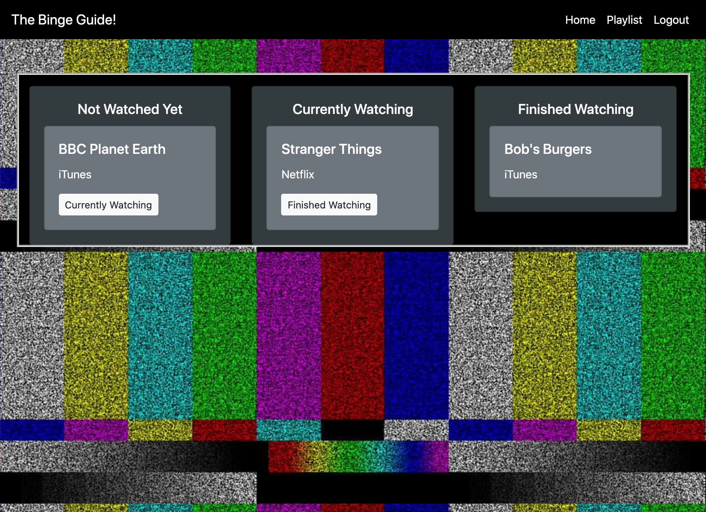

# The Binge Guide

  [](https://opensource.org/licenses/MIT)

## Description 

An application for a user to search show and movie titles to see which platform (Netflix, Hulu, AppleTV etc.) they can watch their show or movie. The user must sign-up for the app and then log-in with a username and password. The user can save shows/movies in columns for binging in the future, currently binging, and finished binging. The user then logs-out when finished using the app. They can log back in any time to find out where and what to start binging on.

The technologies used in this application are:
Node.js, Express, handlebars, passport, sequelize, jQuery, Utelly API, JavaScript, HTML, and CSS

See the URL for the deployed application: https://jmsj2.herokuapp.com/

## Table of Contents

* [Installation](#installation)
* [Usage](#usage)
* [License](#license)
* [Contributing](#contributing)


## Installation

- CREATE and USE a database named ```binge_db```
- Run ```npm install``` in the command-line in order to install all of the dependencies required for the application

## Usage 

Use this application anytime you want find out which streaming service holds the TV show/movie you would like to watch and organize the watch status of the title.

See the screenshots below of the running application:







## License

This application is covered under the MIT license.

## Contributing

The team members responsible for this app are Jessica Blankemeier, Matthew Hyun, Shelby Rothman, and Jack Meier. See the Questions section for each members' contact information.

## Questions

For any additional questions, please contact a Binger:

------------------------------------------
## Jessica Blankemeier
#### GitHub: jessicablank
#### E-mail: jessicablankemeier@gmail.com
------------------------------------------
## Matthew Hyun
#### GitHub: Myhyun
#### E-mail: mattyihyun@gmail.com
------------------------------------------
## Shelby Rothman
#### GitHub: Q118
#### E-mail: SHELBYFISH91@gmail.com
------------------------------------------
## Jack Meier
#### GitHub: meierj423
#### E-mail: jackson.meier423@gmail.com


